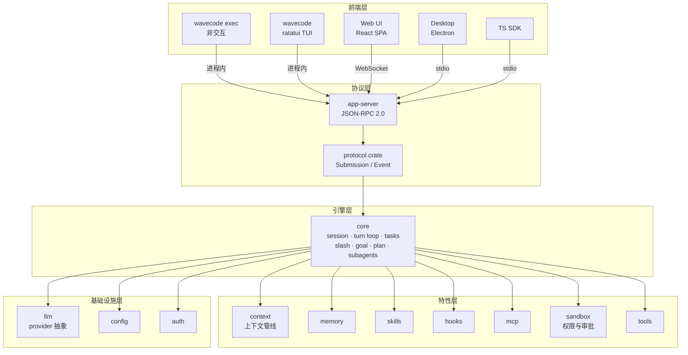

# WaveCode 技术规格（SPEC）

| 项目 | 内容 |
|---|---|
| 版本 | v0.1（M0 基线） |
| 对应产品文档 | [PRD.md](PRD.md)（功能需求与优先级以 PRD 为准，本文档描述实现方案） |
| 参考实现 | OpenAI Codex `codex-rs`（协议与 app-server 架构）、Claude Code cc-haha（agent loop、skills/hooks/memory 机制） |

---

## 1. 架构总览



关键决策（调研结论的落地）：

1. **协议统摄**：所有前端只讲一套协议，core 不知晓前端形态。借鉴 Codex `app-server`，但只做一套协议（Codex 有 legacy `Op/EventMsg` 与 app-server 双轨并行的历史包袱，我们不引入）。
2. **crate 收敛**：15 个 crate。Codex 有 ~109 个 crate（导航与维护成本高），我们按"一个特性域一个 crate"收敛；`core` 内部再按目录分模块。
3. **单一上下文管线**：压缩策略以 trait 插拔，只有一条触发与执行管线（Codex 有 5+ 套 compact 并存实现，属演进事故，设计期规避）。
4. **特性即模块，非插件**：goal/skills/memory 等为核心 crate 内模块；插件化扩展点列入演进路线（§17）。

## 2. 仓库布局与构建

```
WaveCode/
├── Cargo.toml              # [workspace] members = crates/*，edition 2024，resolver 3
├── crates/<name>/          # 15 个 crate，包名统一 wavecode-<name>
├── apps/web/               # @wavecode/web（Vite + React + TS，M4 起）
├── apps/desktop/           # @wavecode/desktop（Electron，M6 起）
├── sdk/typescript/         # @wavecode/sdk（M7 起）
├── docs/PRD.md docs/SPEC.md
├── .github/workflows/ci.yml
└── rustfmt.toml            # max_width = 100
```

- Rust 工具链：stable（≥ 1.85，edition 2024）；`cargo fmt --check`、`cargo clippy --workspace --all-targets -- -D warnings`、`cargo test --workspace` 为 CI 门禁，三 OS（ubuntu/windows/macos）矩阵。
- TS 工具链：pnpm workspace（`packageManager` 字段锁定版本，经 corepack 启用）；ESLint + Prettier（M4 引入时锁定配置）。
- 构建单一二进制：`cargo build -p wavecode-cli --release` 产出 `wavecode`，内含全部子命令；不设 Bazel/nix 等第二构建系统。

## 3. crate 依赖矩阵与边界规则

| crate | 允许依赖（workspace 内） | 职责一句话 |
|---|---|---|
| protocol | — | Submission/Event 类型，serde，TS schema 导出源 |
| config | — | 分层 TOML 解析与合并 |
| llm | — | provider 抽象与流式客户端 |
| tools | llm | Tool trait、注册表、内置工具 |
| context | llm | token 预算、压缩管线 |
| memory | — | WAVECODE.md 与持久记忆 |
| skills | — | SKILL.md 发现/解析/注入 |
| hooks | — | 事件点与 hook 执行 |
| mcp | — | MCP client/server |
| sandbox | protocol（PermissionMode / ApprovalKind 线型） | 权限模式、审批、命令策略 |
| auth | — | 登录与 keyring 凭据 |
| core | protocol, config, llm, tools, context, memory, skills, hooks, mcp, sandbox, auth | agent 引擎 |
| app-server | protocol, core | JSON-RPC 服务与 transport |
| tui | protocol, app-server | 终端 UI |
| cli | protocol, config, llm, tools, core, app-server, tui, auth, sandbox（装配 SessionConfig.sandbox） | 二进制入口 |

边界规则（review 强制；CI 依赖图检查为规划项）：

1. **特性层 crate 互不依赖**（仅两个例外：context→llm 用于 token 计数；tools→llm 用于 ToolSpec schema 桥接，M1 落地）；协作经 core 编排。
2. **tui 不得依赖 core**：只能经 app-server（进程内 transport）与 protocol 交互——保证 TUI 与 Web/Desktop 能力等价。
3. 第三方依赖加进 workspace 根 `[workspace.dependencies]` 统一版本；新增依赖需 PR 说明理由，`cargo-deny` 检查 license 与已知漏洞（M2 引入，M1 尚未落地）。

## 4. 协议规范

### 4.1 核心类型（`crates/protocol`）

```rust
/// 前端 → core 的一次请求；id 由前端生成，关联后续全部事件
pub struct Submission { pub id: String, pub op: Op }

/// core → 前端的事件；id 回填对应 Submission.id
pub struct Event { pub id: String, pub msg: EventMsg }

#[non_exhaustive]
pub enum Op {
    UserInput { text: String, attachments: Vec<Attachment> },
    Interrupt,                                   // 中断当前 turn
    ExecApproval { call_id: String, decision: ApprovalDecision },
    ListThreads, ResumeThread { thread_id: String }, ForkThread { thread_id: String },
    Compact,                                     // 立即压缩（对应 /compact）
    SlashCommand { name: String, args: String }, // 协议层通用 slash
    SetModel { model: String }, SetPermissionMode { mode: PermissionMode },
    Shutdown,
}

#[non_exhaustive]
pub enum EventMsg {
    TurnStarted { turn_id: String },
    AgentMessageDelta { text: String },          // 流式增量
    AgentMessageComplete { text: String },
    ToolCallBegin { call_id: String, tool: String, input: serde_json::Value },
    ToolCallEnd { call_id: String, ok: bool, output: String },
    ApprovalRequested { call_id: String, kind: ApprovalKind, detail: String },
    TokenCount { used: u64, window: u64 },
    CompactStarted, CompactCompleted { summary_tokens: u64 },
    Warning { message: String }, Error { message: String, recoverable: bool },
    TurnCompleted { stop_reason: StopReason },
}
```

规则：`Op`/`EventMsg` 标 `#[non_exhaustive]`；新增变体只增不改；废弃变体保留一个主版本周期。

### 4.2 JSON-RPC 2.0 映射

- 请求：`{"method": "submission", "params": Submission}` → 立即响应 `{"result": {"accepted": true}}`，后续以 `{"method": "event", "params": Event}` 通知推送。
- transport 三选一，语义一致：
  - **stdio**：NDJSON，每行一个消息（Desktop、SDK、外部 IDE 用）；
  - **WebSocket**：文本帧 JSON（Web UI 用），支持多客户端订阅同一会话；
  - **进程内**：tokio mpsc 双工通道，零序列化（TUI 用）。
- 背压：每连接 bounded queue（默认 1024），写满返回错误码 `-32001` 并丢弃最老通知（事件流允许丢帧重同步，请求不允许丢）。

### 4.3 TypeScript schema 导出

`wavecode app-server generate-ts --out <dir>` 从 Rust 类型生成 `protocol.ts` + `json-schema.json`（基于 `schemars`）。Web/Desktop/SDK 只 import 生成物，CI 校验生成物与 Rust 类型一致（重新生成后 `git diff --exit-code`）。

## 5. Agent loop（core）

### 5.1 turn 状态机

借鉴 Claude Code `query.ts` 的状态机循环（无递归，恢复 = 改状态重试）与 Codex `turn.rs` 的任务模型：

```text
loop {
    match state {
        PreTurn      => { context.check_budget()?; inject_steering(goal)?; state = Sampling }
        Sampling     => stream_llm(messages).await?           // 流式产出增量事件
        ToolDispatch => {
            // 只读工具并行（上限 10），写入/破坏性工具串行，顺序保持声明序
            let results = orchestrate(tool_calls).await;
            state = if needs_approval { AwaitApproval } else { MergeResults(results) }
        }
        AwaitApproval => park_until(Submission::ExecApproval)  // 事件驱动唤醒
        MergeResults  => { messages.push(results); hooks.post_tool_use()?; state = Sampling }
        Done(reason)  => { emit(TurnCompleted); hooks.stop()?; return }
    }
}
```

### 5.2 恢复策略（内建于循环，非外挂）

| 触发 | 策略 |
|---|---|
| `prompt_too_long` | 触发 reactive compact（模型写摘要）后以压缩历史重试，连续 3 次失败熔断并上报 |
| `max_output_tokens` | 以续写提示继续，最多续 2 次 |
| 工具超时/异常 | 错误作为工具结果回灌模型，由模型决策；同一工具连续失败 3 次强制暂停等用户 |
| Stop hook 阻塞（goal 模式） | 将阻塞原因注入 steering，继续下一轮 |
| 用户 Interrupt | 安全点中断（工具调用间），保留部分结果，emit `TurnCompleted{Interrupted}` |

### 5.3 任务模型

`TaskKind`：`Regular`（对话）、`Compact`（压缩专用内部 turn）、`Review`（/review 差异评审）、`Goal`（goal 模式驱动）。任意时刻一个 session 一个 ActiveTurn；后台任务（subagent、用户 shell）以独立 session 运行，完成时以 `<task-notification>` 注入父会话。

### 5.4 上下文组装顺序（为 prompt cache 设计）

`[系统提示词·静态层] [系统提示词·动态层（cwd/git 状态/环境）] [WAVECODE.md 拼接] [skills 清单] [持久记忆索引] ——缓存边界—— [会话历史] [工具结果] [用户输入]`

静态层与会话前缀保持字节级稳定，使 provider prompt cache 命中率最大化；动态层集中在一处，避免污染前缀。

## 6. 上下文管线（context crate）

单一管线，三个阶段：

1. **核算**：`token_count(history) + 预计系统开销` 对 `model.context_window` 的占比。
2. **三级阈值**（参考 Claude Code 实测值，按窗口比例参数化）：
   - 警告线：`window - 20k tokens` → 事件提示"接近上限"；
   - 自动压缩线：`window - 13k tokens` → PreCompact hook → 压缩；
   - 阻塞线：`window - 3k tokens` → 不再发起采样，强制先压缩。
3. **压缩**：`CompactionStrategy` trait（`summarize(history, budget) -> summary`）。首版实现 `ModelSummary`（用当前模型生成结构化摘要：目标/进展/关键决策/文件清单/待办）；摘要 + 最近 N 条原文（默认 10）组成新历史。策略可替换，但触发管线只有一条。

历史 normalize：移除被中断的空消息、合并连续工具结果、孤儿 tool_use 补全/剔除（对齐 provider 的严格校验，如 Anthropic 要求 tool_use 必有配对 tool_result）。

## 7. 记忆系统（memory crate）

### 7.1 指令记忆（WAVECODE.md）

- 发现算法：以 `.git` 等项目根标记向上定位项目根；从用户级 `~/.wavecode/WAVECODE.md` → 项目根 → cwd 逐级收集，按"全局在前、局部在后"拼接。
- `@path/to/file` 引用递归展开（深度上限 5，防环）；`.wavecode/rules/*.md` 全部并入。
- 兼容：`WAVECODE.override.md` 覆盖项目级；可配置 fallback 文件名（如 CLAUDE.md/AGENTS.md，PRD F3.5）。

### 7.2 持久记忆（P1）

- 存储：`~/.wavecode/memories/` 下 `MEMORY.md` 索引 + 四类文件（`user.md` / `feedback.md` / `project.md` / `reference.md`），Markdown 条目式。
- 写入：`# 记忆内容` 快捷输入、`/memory add`、或 agent 经 `memory_write` 工具（需审批）写入；读取时索引注入上下文，条目按需加载。
- **自动提取与整合**（P1，PRD F3.4）：会话结束时派生后台 subagent，从会话内容提炼候选记忆条目（按四类追加，附来源会话引用）；整合按门控触发——距上次整合 ≥24h 且期间 ≥5 个新会话——合并重复条目、剔除失效内容、精简 `MEMORY.md` 索引。提取与整合均为后台任务，不阻塞主会话；全部写入经 `/memory` 透明可见、可编辑、可删除。

## 8. Skills（skills crate）

### 8.1 格式与发现

`<root>/skills/<name>/SKILL.md`，frontmatter（YAML）字段（取 Claude Code 与 Codex 字段交集）：

| 字段 | 类型 | 说明 |
|---|---|---|
| `description` | string（必填） | 一句话能力描述，进入清单注入 |
| `when_to_use` | string | 模型自动触发判断依据 |
| `allowed-tools` | string[] | 限定 skill 可用工具 |
| `context` | `inline` \| `fork` | inline 展开进当前会话；fork 以独立 subagent 运行 |
| `user-invocable` | bool | 是否允许 `/name` 直调（默认 true） |
| `argument-hint` | string | 参数提示（补全用） |
| `paths` | glob[] | 命中文件操作时条件激活 |

来源优先级（低→高，同名覆盖）：builtin < `~/.wavecode/skills` < `.wavecode/skills` < MCP 暴露的 skill。

### 8.2 注入与执行

- 清单注入：以 system-reminder 形式注入全部可见 skill 的 `name + description + when_to_use`，预算 = 上下文窗口 1%，超限截断描述。
- 触发：模型调用 `Skill` 工具或用户 `/name [args]`；inline 模式将正文（支持 `$ARGUMENTS` 占位与 `${WAVECODE_SKILL_DIR}` 变量）展开为 user 消息；fork 模式以 skill 正文为系统提示派生 subagent。

## 9. Hooks（hooks crate）

事件点与配置：

```toml
# config.toml
[hooks.PreToolUse]
matcher = "Bash"
command = "./scripts/check.sh"   # 退出码 0 放行；2 阻塞且 stderr 回传模型；其他非零 = 警告放行
timeout_ms = 10000
once = false
```

| 事件点 | 可阻塞 | 典型用途 |
|---|---|---|
| PreToolUse | 是 | 命令审计、自动格式化前置检查 |
| PostToolUse | 否 | lint/格式化回写、通知 |
| UserPromptSubmit | 是 | 注入额外上下文、敏感词拦截 |
| SessionStart / SessionEnd | 否 | 环境初始化、清理 |
| Stop | 是 | goal 模式未达成时阻止结束 |
| PreCompact / PostCompact | 否 | 压缩前后留档 |
| Notification | 否 | 系统通知转发 |

hook 类型：`command`（shell，如上）与 `prompt`（以模板调用模型裁决放行/阻塞，M4 后实现）。来源：用户/项目配置、SKILL.md frontmatter `hooks` 字段。超时强制 kill 并记 warning。

## 10. MCP（mcp crate）

- **客户端**：transport 支持 stdio（spawn 子进程）与 streamable-http（含 OAuth 2.0 + PKCE 流程）；连接失败指数退避重连，`/mcp` 展示状态与工具清单。外部工具以 `mcp__{server}__{tool}` 命名注入注册表，参与相同的权限审批管道；server 暴露的 prompt 自动转换为 inline skill。
- **服务端**（P1）：`wavecode mcp serve` 经 stdio 暴露 WaveCode 工具集与会话能力，使其他 MCP 客户端（IDE、其他 agent）可调用。鉴权：默认仅本机、按 client 白名单。

> P9 落地状态（2026-08-12）：接口边界就绪——`McpClient` / `McpServerHandler` trait、`mcp__{server}__{tool}` 命名拼/拆、`McpServerConfig` 与 `[mcp_servers]` 解析、core 侧 `McpToolBridge`（命名注入 Registry、非只读默认过审批管道）、`/mcp` 命令壳（状态恒"未连接"）与 `SkillSource::Mcp` 占位；真实 stdio/http transport 未实现，留待后续迭代（对齐 rmcp 能力面）。

## 11. 工具系统（tools crate）

### 11.1 Tool trait

```rust
pub trait Tool: Send + Sync {
    fn name(&self) -> &str;
    fn schema(&self) -> serde_json::Value;      // JSON Schema，注入采样请求
    fn is_read_only(&self) -> bool;             // 只读 → 可并行
    fn is_destructive(&self) -> bool;           // 破坏性 → 默认需审批
    async fn validate(&self, input: &Value) -> Result<()>;   // 执行前校验
    async fn execute(&self, input: Value, ctx: &ToolCtx) -> Result<ToolOutput>;
}
```

执行管道：查找 → JSON Schema 校验 → `validate` → PreToolUse hook → 权限/审批（sandbox）→ `execute` → PostToolUse hook → 结果回灌。

### 11.2 内置工具清单

| 工具 | 只读 | 说明 |
|---|---|---|
| `read_file` / `glob` / `grep` / `list_dir` | 是 | 文件查看与检索，输出截断保护 |
| `write_file` / `edit_file` | 否 | 精确编辑（old_string 唯一匹配），写前产出 diff 事件 |
| `shell` | 否 | shell 命令，超时/输出上限，前台/后台两种模式 |
| `web_search` / `web_fetch` | 是 | 搜索与页面抓取（SSRF 防护：禁内网地址段） |
| `todo_write` | 否 | 任务清单（session 内状态，整体重写；session-state 工具各模式免审批，§12） |
| `task` / `task_output` / `task_stop` | 否 | subagent 派生与后台任务管理（P1） |
| `memory_write` | 否 | 持久记忆写入（四类 + MEMORY.md 索引；非只读经默认策略审批，§7.2，2026-08-12 P6 落地） |
| `skill` | 否 | skill 触发入口（P1） |
| `browser_*`（navigate/click/type/scroll/screenshot/snapshot/console） | 混合 | Desktop 内置浏览器（§15.3，P1）；非 Desktop 环境不注册 |

## 12. 安全模型（sandbox crate）

- **权限模式**（`PermissionMode`，会话级，`/permissions` 或 Shift+Tab 切换）：`default`（写/执行/破坏性逐次审批）、`plan`（仅只读工具可用）、`acceptEdits`（文件编辑自动放行，shell 仍审批）、`bypassPermissions`（全放行，进入时需输入确认短语）。
- **规则语法**：`allow`/`deny` 列表，条目如 `Bash(git *)`、`Bash(npm run test)`、`File(src/**)`；匹配顺序 deny 优先；命中 allow 免审批。
- **审批流**：core 发 `ApprovalRequested` 事件 → 前端展示（命令全文/文件 diff/影响说明）→ `ExecApproval` 回填；选项含"本次放行/始终放行（写入规则）/拒绝（附原因回传模型）"。
- **session 内状态工具豁免**（P4）：`todo_write` 只改会话内存清单、无外部副作用，各模式免审批直接放行（对齐 deepagents write_todos）；deny 规则判定仍在豁免之前。
- **OS 级沙箱**（P2，演进路线 §17）：Linux landlock、macOS seatbelt、Windows ACL 受限令牌，与权限模式正交（机制与策略分离）。

## 13. 配置 schema（config crate）

`~/.wavecode/config.toml`（用户级）与 `<项目>/.wavecode/config.toml`（项目级），合并规则：标量项目级覆盖用户级；map 按键合并；数组替换不拼接。CLI 参数最高优先级。

```toml
model = "claude-sonnet-4-5"
model_provider = "anthropic"
permission_mode = "default"          # 四档，见 §12
profile = "work"                     # -p / --profile 等价

[model_providers.anthropic]
type = "anthropic"
base_url = "https://api.anthropic.com"
env_key = "ANTHROPIC_API_KEY"        # 凭据也可存 keyring，见 §14

[model_providers.deepseek]           # 自定义 OpenAI 兼容端点示例
type = "openai-compatible"
base_url = "https://api.deepseek.com"
env_key = "DEEPSEEK_API_KEY"
wire_api = "chat"                    # chat completions

[profiles.work]
model = "claude-opus-4-6"
permission_mode = "acceptEdits"

[mcp_servers.playwright]
command = "npx"
args = ["@playwright/mcp@latest"]

[mcp_servers.remote]
url = "https://mcp.example.com/sse"  # streamable-http + OAuth

[projects."D:/code/important"]       # 按目录覆盖
permission_mode = "default"

[features]                           # 实验特性开关（feature flags）
goal_mode = true
```

## 14. 认证（auth crate）

- API key：`config.env_key` 指向环境变量，或 `wavecode login <provider>` 交互录入后存系统 keyring（`keyring` crate：Windows 凭据管理器 / macOS Keychain / Secret Service）。
- OAuth（P1）：PKCE + localhost 回调页，refresh token 存 keyring，过期自动刷新。
- 凭据永不写日志、永不进会话历史；`debug-config` 输出自动脱敏。

## 15. 前端规格

### 15.1 TUI（tui crate）

- ratatui；布局：消息流 / 输入框 / 状态栏（模型、权限模式、token 用量、cwd）。
- slash 补全（`/` 弹出候选，按 feature flag 过滤）；Esc 中断；`!` 前缀直接执行 shell；审批内联弹窗；diff 语法高亮视图。
- 经 app-server 进程内 transport 接入，**不 import core**：保证与远端前端能力等价。

> P8 落地状态（2026-08-12）：三段布局、markdown 渲染（对齐 §15.5）、slash 补全弹层、Esc 中断、审批内联弹窗已落地；`!` 前缀直接执行 shell 与 diff 语法高亮视图留待后续里程碑。

### 15.2 Web UI（apps/web）

- Vite + React + TypeScript；状态管理 Zustand；协议客户端封装为 `WavecodeClient`（WebSocket，自动重连 + 事件重同步）。
- 页面：会话列表（多会话并行）、对话视图（流式渲染、工具调用折叠卡、diff 视图）、审批弹窗、设置页（模型/provider/权限/规则）。
- UI 组件库独立为内部包，Desktop 复用同一组件树（M6）。

### 15.3 Desktop（apps/desktop）与内置浏览器

- Electron；主进程以 stdio spawn `wavecode app-server`；渲染进程加载 Web UI 组件树。
- **内置浏览器**：独立 `BrowserView`/`webContents` 标签页；主进程经 `webContents.debugger.attach("1.3")` 建立 CDP 通道。
- **browser 工具桥**：Desktop 主进程作为 app-server 客户端注册 `browser_*` 工具；core 发起工具调用 → app-server 路由到 Desktop → CDP 执行（`Page.navigate` / `Input.dispatchMouseEvent` / `Runtime.evaluate` / `Page.captureScreenshot` / DOM 快照经 `Accessibility.getFullAXTree`）→ 结果回灌。用户手动操作与 agent 操作共存：agent 操作前检测页面"用户活跃中"（最近 2s 有输入事件）则等待或询问。
- 安全：`browser_*` 写操作（click/type/navigate 至新域）默认走审批；截图不离开本机。

### 15.4 CLI 子命令

| 命令 | 用途 |
|---|---|
| `wavecode`（默认） | 进入 TUI |
| `wavecode exec "<prompt>" [--json]` | 非交互执行；`--json` 输出 JSONL 事件流 |
| `wavecode app-server [--stdio | --ws :port] [generate-ts]` | 启动协议服务 / 导出 TS schema |
| `wavecode mcp serve` / `wavecode mcp add <name> <cmd>` | MCP server / 客户端配置管理 |
| `wavecode login / logout` | 认证 |
| `wavecode resume [thread-id]` | 恢复会话 |
| `wavecode --version / --help` | 信息与帮助 |

> M1 落地状态（2026-08-03）：`wavecode`（默认）与 `wavecode exec [--json]` 已可用——默认进入基础行式 REPL（ratatui TUI 在 M2）；`--version/--help` 由 clap 自带。其余子命令（`app-server`/`mcp`/`login`/`resume`）为后续里程碑。
> P8 更新（2026-08-12）：`wavecode`（默认）在 TTY 下进入 ratatui TUI；非 TTY 或 `--repl` 回退行式 REPL。

### 15.5 CLI human 渲染契约（2026-08-03 起，取代 M1 裸流式）

- 助手消息：delta 经 sanitize 后缓冲，`AgentMessageComplete`（或中断残余）时经
  `markdown::render_markdown` 渲染（标题亮青加粗/粗斜删/行内码黄/代码块 `│ ` 边线/
  表格 CJK 对齐+超宽压缩）；--json 路径不受影响。
- 工具行：`▸ {工具名亮青} {input摘要≤80字符暗灰}`；失败 `✗ {output≤200字符}` 红；
  Warning 黄 / Error 红；tokens 行暗灰；`（已中断）` 黄。
- 品牌：REPL 启动横幅为音频波形块（TTY 播放 12 帧滚动彩色动画后定格），
  提示符亮青 `∿ `；等待模型期间显示滚动彩色波形指示（80ms/帧）。
- 降级：非 TTY 由 anstream 剥离 ANSI 且无动画；`NO_COLOR` 尊重；终端宽度
  取自 terminal_size，不可用回退 80。

## 16. 会话持久化

- rollout 文件：`~/.wavecode/threads/<thread-id>.jsonl`，每行一条带序号的持久化事件（用户输入、agent 消息、工具调用、压缩记录、状态快照）。
- 索引：SQLite（`threads.db`：id、标题、cwd、模型、更新时间、消息数），`/resume` 列表与全文检索基于索引。
- 恢复语义：replay rollout 重建上下文；压缩点之后的原文 + 摘要即新历史；`fork` 复制 rollout 到指定序号。

## 17. 演进路线（明确不在本期实现）

1. **插件化扩展点**：core 稳定后抽象 `Extension` trait（注入 ContextContributor / Tool / Hook / McpServer），goal、memory、skills 改造为内建扩展——参考 Codex `ext/extension-api`，等接口收敛后再抽（YAGNI）。
2. **OS 级沙箱**：§12 所述，策略与机制分离。
3. **远程执行环境**：exec 环境抽象（本地/容器/远程机统一），对标 Codex `exec-server`。
4. **云任务与团队协作**、**插件市场**。

### §17.5 M2+ 准备项（2026-08-03 五路审查遗留）

**M2（TUI/transport）**
- llm：流读停滞检测（N 秒无事件判死，Anthropic ping 心跳可作判据）；fs 工具迁移 `tokio::fs`（spawn_blocking 已是过渡修法，评估是否值得整体迁移）；`LlmError::Http` 做重试策略时引入自有 `HttpKind` 枚举分类
- app-server：Drop 路径补测试；actor_loop 抽 transport 无关的内部构造函数（stdio/WS 复用）；MockModel/GatedModel 抽 dev-only 共享 fixture（core 与 app-server 测试同构重复）
- tools：shell 孙进程进程组回收
- core：`read_only_tools_run_in_parallel_via_spawn_blocking` 真并行阈值测试在过载 CI 的 flaky 观察（阈值裕度 350/400ms）
- config：TOML Parse 错误行级脱敏（api_key 行语法错误时不回显原文）
- 终端：ratatui TUI 渲染同样必须走 sanitize（cli render.rs 已落地，TUI 复用语义）

**M3（工具与安全）——开工第一天决策项**
- Registry → `Arc<RwLock<…>>`（MCP 重连/热注册；session.rs 每轮 `specs()` 已留姿态）；sandbox 规则状态同步 Arc 化
- 审批反向通道：复用 interrupt_handle 模式（共享槽 + actor in-turn select! 路由 + run_turn park 等待，即 SPEC §5.1 AwaitApproval）
- Tool trait 对齐 §11.1：`is_destructive()`/`validate()` 用默认实现落地，不动内置 impl
- config 分层：新增全 Optional 的 `PartialConfig` 逐层解析、按 §13 规则合并产出 Config
- 协议：外部工具注册 op（Desktop browser_* 桥需要）——M5 前把扩展方案写入 §4.1

**M4（上下文与记忆）**
- system prompt 分层组装 builder（§5.4：P4 已落地静态层/动态层/todo 清单注入与字节稳定前缀纪律；WAVECODE.md/skills/记忆槽位待 P6/P7 填充）
- Session 压缩方法（摘要替换历史前缀）；每轮 `messages.clone()` 全量复制的 O(n²) 改借用/Arc
- hooks→llm 依赖边决策（推荐 core 编排 prompt hook，矩阵不动）
- CI 加固：cargo-deny/cargo-audit 落地（`nix 0.29.0` 待确认）、nextest 评估

**M5（Web/Desktop）**
- 事件 fan-out（broadcast 多客户端订阅）；generate-ts 前端容错规范（容忍未知 type tag 与 stop_reason 字符串）

## 18. 测试策略

- 单元测试与源码同文件/同目录（`*_tests.rs`）；纯逻辑（协议编解码、配置合并、上下文核算、规则匹配）100% 可单测，不依赖网络。
- 集成测试集中在 `crates/core/tests/`（`suite/` 场景文件 + `common/` mock）：以 **mock provider**（录制/回放流式响应）驱动完整 turn；golden 测试锁定协议事件序列。
- 协议兼容性：`generate-ts` 产物 CI diff 校验；`Op`/`EventMsg` 增删变体的向后兼容测试。
- UI：TUI 用 insta snapshot；Web 用 Playwright 组件测试（M5 起）。
- E2E：每里程碑验收场景脚本化（PRD §7 验收标准逐条对应）。
- 测试运行器：M1 现状为 `cargo test`；cargo-nextest（CI 限制并发组、失败重试 1 次）为规划项，随 CI 加固引入。

## 19. 编码规范

1. 注释与文档用**中文**；技术术语保留英文（如 `Submission`、`prompt cache`）；公开 API 必须有 doc comment。
2. 错误处理：crate 边界用 `thiserror` 定义错误枚举；core 内部用 `anyhow`；禁止跨 crate 泄漏第三方错误类型；禁止静默吞错。core 与 app-server 的 pub API 使用 anyhow 是 M1 知情决策（stdio transport 落地时统一重塑错误面）。
3. 异步：tokio；不在 async 上下文做阻塞 IO（文件操作用 `tokio::fs` 或 `spawn_blocking`）。
4. 日志：`tracing` 结构化日志，span 携带 `thread_id`/`turn_id`；凭据与敏感内容打 `skip` 标记。
5. 依赖：新增第三方 crate 需在 PR 说明（功能、维护状态、license），优先 workspace 统一版本。
6. 每个里程碑完成后更新本 SPEC 与 PRD 状态列，文档与实现对账。
