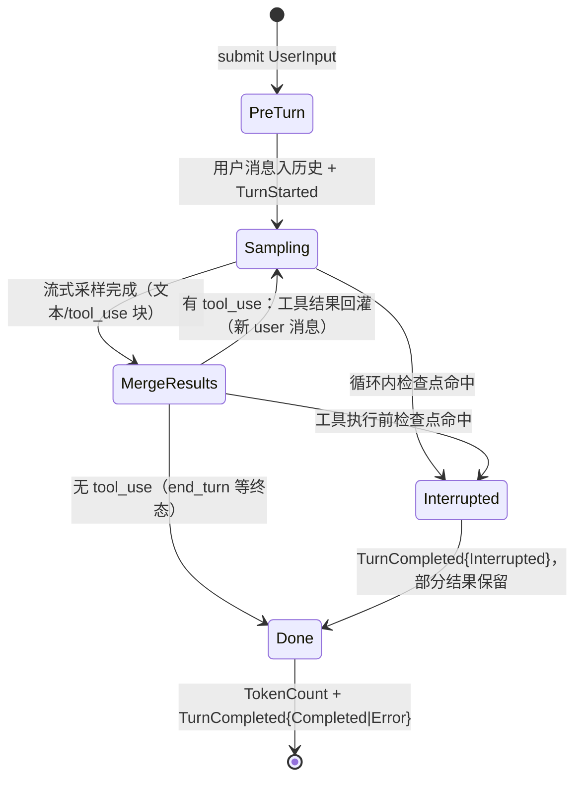

# Agent 引擎（wavecode-core）

## 职责

`wavecode-core` 是 agent 引擎（`crates/core/src/lib.rs`）：session 生命周期、turn 状态机循环、任务模型、slash 指令分发、goal / plan 模式、subagent 编排与后台任务。**M1 已落地**：`session` 模块（Session 生命周期与 turn 状态机循环，mock 模型验证）；任务模型 / hooks / subagent 编排随后续里程碑补齐。

只依赖 `wavecode_protocol` / `wavecode_llm` / `wavecode_tools` 的公开接口（config / context / memory / skills / hooks / mcp / sandbox / auth 按 SPEC §3 矩阵留给 M2+ 引回），不感知任何前端形态；与前端的唯一交互通道是 `wavecode_protocol` 的 Submission / Event（经 [app-server](../runtime/app-server.md) 的 actor 驱动）。

## Session 与配置

`SessionConfig`（`Session::new` 后冻结为快照）：`model_name` / `context_window`（TokenCount 事件 `window` 字段）/ `max_output_tokens`（请求 `max_tokens`）/ `model: Arc<dyn ChatModel>` / `registry: Registry` / `cwd`（系统提示词展示 + `ToolCtx::cwd` 根）/ `deny_env`（透传 `ToolCtx`，shell 工具 spawn 前剔除）。

`Session { cfg, messages: Vec<Message>, interrupted: Arc<AtomicBool> }`：完整消息历史 + 共享中断标志。系统提示词为静态模板（`SYSTEM_PROMPT_TEMPLATE`，`{cwd}` 运行时替换）：角色声明 + 工作目录 + 三条规则（优先 edit_file、简洁总结、不得捏造文件内容或命令结果）。

## Turn 状态机循环（`run_turn`）

循环六步（`crates/core/src/session.rs`）：

1. **用户消息入历史** + `TurnStarted { turn_id }`（uuid）；中断标志每 turn 自清（上一 turn 的 interrupt 不影响本轮）。
2. **组装 `ChatRequest`**（system 模板替换 cwd、`messages.clone()`、`registry.specs()`、max_tokens）发起流式采样；`stream()` 失败（或流中途出错）：`fail_turn` 收尾——发 `Error { message, recoverable: false }` + `TurnCompleted { Error }` 防前端悬挂，然后以 Err 返回调用方。
3. **消费流**（`RoundBlocks`）：`TextDelta` 累计 cur_text 并逐段发 `AgentMessageDelta`；`ToolUseBegin` 开块（防御：畸形流未 BlockEnd 就开新块先 close_open）；`ToolUseInputDelta` 缓冲 partial_json；`BlockEnd` 关闭块（invalid json 的 tool_use 以空对象入历史 + 预置 is_error 结果，不实际执行）；`MessageComplete` 取最后一个非空 stop_reason、记录 input/output_tokens。
4. **assistant 消息入历史** + `AgentMessageComplete { full_text }`；**空响应不入历史**（Anthropic 拒绝空 content 数组，入历史会污染后续每个 turn）。
5. **工具编排**（见下）→ 结果作为一条 user 消息回灌 → 回步骤 2。
6. **终态**：`max_tokens` 先发 Warning（"output truncated: max_tokens reached"）再按 Completed 收尾；发 `TokenCount { used: 末轮 input_tokens + 各轮 output_tokens 累计, window }`；发 `TurnCompleted { Completed }`。

## 中断语义

`interrupt_handle()` 返回共享 `Arc<AtomicBool>`（T8 驱动模式：actor 在 `select!` 中置位，绕开 `run_turn(&mut self)` 借用冲突）。检查点（安全点）：

- **循环头**：步骤 5 串行工具段中断后回到循环头——结果消息已完整回灌，不再发起多余采样，直接收尾；
- **流消费循环内**：历史保留部分结果（`finish_interrupted`：关闭未关闭块、assistant 消息入历史、悬空 tool_use 合成 is_error 结果配对；不发 AgentMessageComplete）；
- **工具执行前**：assistant 已入历史，为悬空 tool_use 合成 "interrupted by user" 结果保持配对；
- **串行工具迭代间**：剩余调用以 interrupted 结果收尾（不 break——ToolResult 必须与全部 tool_use 配对）。

中断路径收尾均为 `TurnCompleted { Interrupted }`，不发起额外采样请求。

## 工具编排（`execute_tool_calls`）

- 取历史末尾 assistant 消息的 tool_use 块（声明序）。
- 事件序：**先按声明序发全部 `ToolCallBegin`**，执行结束后**按声明序发全部 `ToolCallEnd`**（并行批内无法逐调用穿插 begin/execute/end，统一前置/后置是最简单且保序的形态）。
- 预填槽位：invalid-json 预置结果、unknown-tool（`unknown tool: {name}` is_error）不实际执行、不中断 turn。
- **只读调用 `join_all` 并行（保序）**，包 `spawn_blocking`（M1 内置工具 execute 内为阻塞 std::fs，spawn_blocking 移出 executor 线程才获得真实并行；M2 迁移 tokio::fs 后可还原）。**知情延后**：批内重排为"全部只读并行 → 非只读串行"，如 [R1, W1, R2] 实际执行 R1∥R2 → W1——R2 读到 W1 写入前的内容；M2 考虑按连续只读段分组贴近声明执行序。
- **非只读串行**（同样包 spawn_blocking）。
- `ToolCallEnd` 输出回显截断 2000 字符（回灌模型的 ToolResult 不截断）；execute 的 `Err`（io 故障）与 `spawn_blocking` JoinError 同样转 is_error 回灌，不中断 turn。
- **ToolResult 配对约束**（Anthropic 严格要求 tool_use 必有配对 tool_result）：所有路径（含中断）都保证声明序配对完整。

## 事件序列契约

- 每个 turn 以 `TurnStarted` 首发；正常以 `TokenCount + TurnCompleted` 收尾；错误路径 `fail_turn`（`Error { recoverable: false }` + `TurnCompleted{Error}`）后以 Err 返回调用方；中断路径 `TurnCompleted{Interrupted}`。
- `emit` 尽力投递：send 失败即 receiver 已关闭（前端断开），记 debug 日志并继续执行——历史一致性优先，事件流只是旁观通道；channel 满时 send 自然挂起形成背压。

## 聚焦测试（`crates/core/src/session.rs` tests）

`MockModel`（脚本化：按调用次数返回预排事件序列，记录每次请求供断言回灌）与 `GatedModel`（回放脚本后挂起直到 gate 置位，驱动中断检查点确定性触发）：

| 测试 | 锁定的行为 |
|---|---|
| `turn_executes_tool_and_completes` | write_file 实际执行、事件序列（turn_started → tool_call_begin/end → token_count → turn_completed）、tool_result 回灌第二次请求 |
| `unknown_tool_returns_error_result_not_crash` | 未知工具 → ToolCallEnd{ok:false} + is_error ToolResult 回灌，不崩溃 |
| `read_only_tools_run_in_batch_results_ordered` | 只读批并行、结果按声明序回灌 |
| `read_only_tools_run_in_parallel_via_spawn_blocking` | 慢工具 200ms + 快工具同批：总耗时 < 350ms（串行应 ≥400ms），证明 spawn_blocking 真并行 |
| `interrupt_in_stream_keeps_tool_pairing` | 流给到一半中断：部分结果保留、悬空 tool_use 配对 is_error、无第二次采样 |
| `interrupt_in_serial_tools_skips_resample` | 串行段中断：剩余调用以 interrupted 收尾、配对完整（t1/t2 声明序）、不重采样 |
| `invalid_tool_json_returns_error_result_not_execute` | tool input JSON 解析失败：不实际执行、is_error 回灌且配对 |
| `max_tokens_warns_then_completes` | max_tokens 终态：先 Warning 再按 Completed 收尾 |
| `deny_env_flows_to_tool_ctx` | SessionConfig.deny_env 原样透传 ToolCtx（CtxProbe 探针锁定接线） |

## 已知边界与 M2+ 扩展

- M1 无 hooks / 审批 / compaction / 续写（YAGNI，循环结构留扩展位）；messages 每轮全量 clone（O(n²)，M4 改借用/Arc）。
- **M2+ 扩展范围（core 内部模块，非 stub crate）**：任务模型（TaskKind：Regular / Compact / Review / Goal，SPEC §5.3）、slash 指令分发（协议层通用 `Op::SlashCommand`，SPEC §4.1 与 PRD §5.4）、goal / plan 模式、subagent 编排与后台任务（独立 session 运行，`<task-notification>` 注入父会话）。

## 相关页面

- 协议：[前后端协议（wavecode-protocol）](../protocol/protocol.md)
- 服务面：[协议服务（wavecode-app-server）](../runtime/app-server.md)
- 依赖：[模型抽象层（wavecode-llm）](llm.md)、[工具系统（wavecode-tools）](tools.md)
- 规划：[规划中的特性 crate（stub）](../planned/feature-crates.md)
