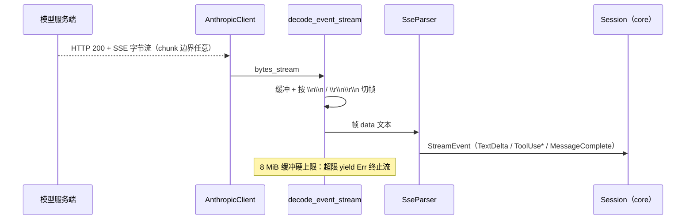

# 模型抽象层（wavecode-llm）

## 职责

`wavecode-llm` 是多 provider 抽象层（`crates/llm/src/lib.rs`）。M1 阶段包含：公共类型与 `ChatModel` trait、Anthropic Messages streaming SSE 解析器（`SseParser`）、内置实现 Anthropic Messages API 流式客户端（`AnthropicClient`）。OpenAI 兼容 provider 的 HTTP 客户端、token 计数与模型能力表为后续里程碑。

## 公共类型

- `Role`：`User` / `Assistant`（serde lowercase）。
- `ContentBlock`（tag `"type"` snake_case）：`Text { text }` / `ToolUse { id, name, input }` / `ToolResult { tool_use_id, content, is_error }`——tool_use/tool_result 配对是 Anthropic 硬约束（[core](core.md) 保证配对完整）。
- `Message { role, content: Vec<ContentBlock> }`；`ToolSpec { name, description, input_schema }`（注入采样请求的工具清单）；`Usage { input_tokens, output_tokens }`。
- `StreamEvent`：`TextDelta` / `ToolUseBegin` / `ToolUseInputDelta` / `BlockEnd` / `MessageComplete { stop_reason, usage }`——统一流式事件流。
- `ChatRequest { model, system, messages, tools, max_tokens }`。
- `ChatModel` trait：`async fn stream(&self, req: ChatRequest) -> Result<EventStream>`；`EventStream = Pin<Box<dyn Stream<Item = Result<StreamEvent>> + Send>>`。
- `LlmError`：`Http(String)` / `Api { kind, message }` / `Sse(String)` / `Json(serde_json::Error)`。

## AnthropicClient（`anthropic.rs`）

`POST {base_url}/v1/messages`（base_url 尾部 `/` 剔除防双斜杠）发起 SSE 流式请求，字节块流经缓冲切帧后交给 `SseParser` 逐条解析为 `StreamEvent`。

**HTTP 客户端安全与健壮性**（`build_http_client`）：

- 只设 `connect_timeout`（10s）：防 connect 阶段停滞挂死；**不能**设 `Client::timeout`——那会掐断正常的长 SSE 流（流读停滞检测是 M2 待办）。
- **禁用重定向**：`redirect::Policy::none()`——Messages API 端点无合法重定向语义，且 reqwest 默认跟随重定向会把 `x-api-key` 带到跨源目标（PoC 实测）。
- **非 2xx 统一映射**为 `LlmError::Api { kind: "http_{status}", message }`（如 301 → `http_301`）；错误响应体截断 2000 字符（`MAX_ERROR_BODY_CHARS`，按 char 截断不切碎多字节）；api key 仅在请求头，绝不写入错误信息。
- 请求头：`x-api-key` / `anthropic-version: 2023-06-01` / `content-type: application/json`；`stream: true` 固定。

## SSE 管道

- `decode_event_stream`：字节缓冲按帧边界切分（`\n\n` 或 `\r\n\r\n`，取先出现者；扫描位置回退 3 字节防分隔符跨 chunk 的 O(n²) 重扫）；**8 MiB 缓冲硬上限（`MAX_SSE_BUF`）**——超出即判定服务端未按帧边界发数据，yield `LlmError::Sse` 终止流（防恶意/异常服务端撑爆内存）；`extract_data` 提取多行 data（冒号后至多一个前导空格，按 SSE 规范；**无 `data:` 行的帧产出空（无事件）**）；流末尾的不完整帧按 SSE 惯例丢弃。
- `SseParser` 状态机（有状态：累计 `message_start` 上报的 input_tokens，在 `message_delta` 合成 `MessageComplete` 时一并返回）：`message_start` 累计 input_tokens；`ping` / `message_stop` 返回 None；`content_block_start`（tool_use → `ToolUseBegin`）；`content_block_delta`（text_delta / input_json_delta）；`content_block_stop` → `BlockEnd`；`message_delta` 合成 `MessageComplete`（stop_reason 为 null 按空串处理）；`error` → `LlmError::Api`；**未知类型一律忽略**（向前兼容）。反序列化结构对未知块/增量类型归入 `Other` 并忽略。

## 聚焦测试

| 测试 | 位置 | 锁定的行为 |
|---|---|---|
| `messages_url_trims_trailing_slashes` | anthropic.rs | URL 拼接去尾斜杠 |
| `error_body_truncated_at_2000_chars` | anthropic.rs | 错误体按 char 截断、多字节不切碎 |
| `request_body_matches_anthropic_format` | anthropic.rs | 请求体字段与消息块 type tag 精确匹配 Anthropic 格式 |
| `stream_parses_recorded_sse` | anthropic.rs | 录制 SSE 文本 → TextDelta 序列（含 UTF-8 文本） |
| `stream_handles_split_frames` / `stream_handles_crlf_frames` | anthropic.rs | 帧被 TCP 拆段 / 纯 CRLF 与 LF 混合流，事件不丢 |
| `stream_joins_multi_line_data` | anthropic.rs | 一帧内多行 `data:` 以 `\n` 拼接后解析 |
| `stream_handles_crlf_separator_split_across_chunks` | anthropic.rs | 4 字节 `\r\n\r\n` 分隔符以 3 字节片喂入（必跨 chunk）：锁定 `scanned - 3` 续扫回退，事件不丢 |
| `stream_errors_and_terminates_when_buffer_exceeds_cap` | anthropic.rs:380 | 缓冲超 8 MiB 上限 yield Err 并立即终止流（后续 chunk 不再消费） |
| `redirect_is_not_followed_and_api_key_not_leaked` | anthropic.rs | 本地双 TCP listener：A 收到带 key 的请求后回 301 → 客户端报 http_301 而非跟随，B 永远收不到请求（教科书级安全回归） |
| `parses_text_delta` / `parses_tool_use_lifecycle` / `accumulates_usage_into_complete` / `api_error_is_err` / `unknown_event_type_is_ignored` / `null_stop_reason_becomes_empty_string` / `missing_type_field_is_ignored` / `unknown_nested_delta_is_ignored` / `malformed_json_is_err` | sse.rs | SseParser 分发规则、usage 累计、error → Api、未知类型/缺 type 字段忽略（向前兼容）、null stop_reason → 空串、坏 JSON → Err |

## 已知缺口

- OpenAI 兼容 provider（`ProviderKind::OpenAiCompatible`）HTTP 客户端未实现（bootstrap 现仅 AnthropicClient 一种实现）。
- token 计数、模型能力表未实现（context 管线依赖，M4）。
- 流读停滞检测（N 秒无事件判死）M2；`LlmError::Http` 重试策略引入自有 `HttpKind` 枚举分类（SPEC §17.5）。

## 相关页面

- 消费方：[Agent 引擎（wavecode-core）](core.md)（Session 经 `ChatModel::stream` 采样）、[命令行入口（wavecode-cli）](../runtime/cli.md)（bootstrap 装配）
- 配置：[配置系统（wavecode-config）](config.md)（provider 解析出 base_url + api_key）
- 规划：[规划中的特性 crate（stub）](../planned/feature-crates.md)（context crate 依赖 llm token 计数）
