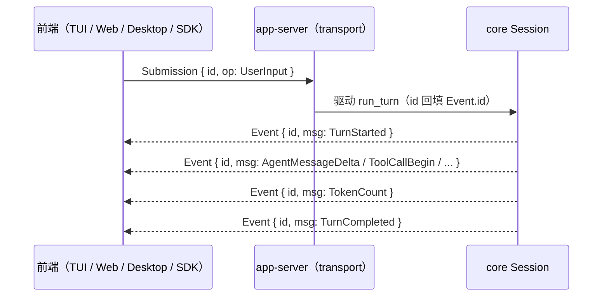

# 前后端协议（wavecode-protocol）

## 职责

`wavecode-protocol` 是前后端协议的**唯一事实源**（`crates/protocol/src/lib.rs`）：定义 `Submission { id, op: Op }`（前端 → core 的请求）与 `Event { id, msg: EventMsg }`（core → 前端的事件流），`id` 用于关联一次请求与其全部后续事件。所有 Rust crate 与前端（TUI / Web / Desktop）共享此协议；TypeScript 侧类型由 `wavecode app-server generate-ts`（规划，SPEC §4.3）从此处导出。

## 核心类型

```rust
pub struct Submission { pub id: String, pub op: Op }
pub struct Event { pub id: String, pub msg: EventMsg }
```

- `Op`（`#[non_exhaustive]`，serde tag = `"type"`，snake_case）——**M1 三变体**：`UserInput { text }` / `Interrupt` / `Shutdown`。SPEC §4.1 规划的其余变体（`ExecApproval`、`ListThreads`、`ResumeThread`、`ForkThread`、`Compact`、`SlashCommand`、`SetModel`、`SetPermissionMode`）为 M2+。
- `EventMsg`（`#[non_exhaustive]`，9 变体）：`TurnStarted { turn_id }` / `AgentMessageDelta { text }` / `AgentMessageComplete { text }` / `ToolCallBegin { call_id, tool, input }` / `ToolCallEnd { call_id, ok, output }` / `TokenCount { used, window }` / `Warning { message }` / `Error { message, recoverable }` / `TurnCompleted { stop_reason }`。
- `StopReason`（snake_case）：`Completed` / `Interrupted` / `Error`。

## 演进纪律

- `Op` / `EventMsg` 标 `#[non_exhaustive]`：新增变体只增不改；废弃变体保留一个主版本周期（SPEC §4.1）。
- **线上格式锁定**：`wire_type_tags_locked` 测试逐变体断言精确的 `"type"` tag（`user_input` / `interrupt` / `shutdown` / `turn_started` / … / `turn_completed`）——新增变体必须在表中登记，改动既有 tag 即破坏线上兼容。
- `StopReason` snake_case 全量锁定。

## 协议流程



目标 JSON-RPC 2.0 映射（SPEC §4.2，stdio / WebSocket transport 落地时引入）：`{"method":"submission","params":Submission}` → 立即响应 `{"result":{"accepted":true}}`，后续以 `{"method":"event","params":Event}` 通知推送。背压：每连接 bounded queue（默认 1024），写满返回 `-32001` 并丢弃最老通知（事件流允许丢帧重同步，请求不允许丢）。

## 聚焦测试

| 测试 | 锁定的行为 |
|---|---|
| `submission_roundtrip` | Submission 序列化/反序列化往返，含精确 JSON 形态断言 |
| `event_roundtrip_tool_call` | ToolCallBegin 事件往返 |
| `wire_type_tags_locked` | Op（3 变体）与 EventMsg（9 变体）的 type tag + StopReason snake_case 全量锁定——协议兼容性的物理证据 |
| `turn_completed_wire_format_locked` | `EventMsg::TurnCompleted` 嵌套 stop_reason 的精确 JSON：`{"type":"turn_completed","stop_reason":"completed"}`，包进 Event 后 `{"id":"s-1","msg":{...}}` 不变 |

## 相关页面

- 服务面：[协议服务（wavecode-app-server）](../runtime/app-server.md)
- 引擎消费：[Agent 引擎（wavecode-core）](../engine/core.md)
- 前端契约：[前端与 SDK 占位包](../planned/frontends.md)
