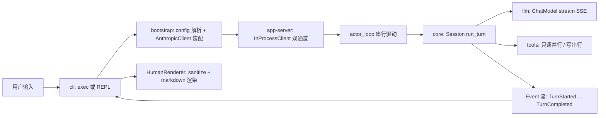

# WaveCode 代码维基 — 快速入门

## 仓库一句话定位

**WaveCode** 是一个多平台 AI coding agent（CLI / TUI / Web / Desktop 四端同核）：Rust workspace（15 crate）实现单一 agent 核心，经统一 JSON-RPC 协议（app-server）接入各前端。当前为 **M1 里程碑**：7 个 crate 已实现（protocol / config / llm / tools / core / app-server / cli），8 个 crate 为规划占位（auth / context / hooks / mcp / memory / sandbox / skills / tui），3 个 TS 包仅占位（[前端与 SDK 占位包](planned/frontends.md)）。设计权威：[架构总览](architecture/overview.md)、[文档地图](operations/docs.md)（PRD/SPEC/review）。

## 维基地图

| 目录 | 页面 | 内容 |
|---|---|---|
| `architecture/` | [架构总览](architecture/overview.md) | 分层架构、15 crate 依赖矩阵与边界规则、M1 状态与里程碑路线 |
| `protocol/` | [前后端协议（wavecode-protocol）](protocol/protocol.md) | Submission/Event 类型、线上格式锁定、演进纪律 |
| `engine/` | [Agent 引擎（wavecode-core）](engine/core.md) | Session 与 turn 状态机、中断语义、工具编排 |
| `engine/` | [模型抽象层（wavecode-llm）](engine/llm.md) | ChatModel trait、Anthropic SSE 客户端与解析管道 |
| `engine/` | [工具系统（wavecode-tools）](engine/tools.md) | Tool trait、5 个内置工具、路径护栏与 shell 安全 |
| `engine/` | [配置系统（wavecode-config）](engine/config.md) | TOML 加载、provider 解析、凭据脱敏 |
| `runtime/` | [协议服务（wavecode-app-server）](runtime/app-server.md) | 进程内 transport、Session actor、FIFO 排队 |
| `runtime/` | [命令行入口（wavecode-cli）](runtime/cli.md) | exec/REPL、装配链、人类渲染与 markdown 终端渲染 |
| `planned/` | [规划中的特性 crate（stub）](planned/feature-crates.md) | 8 个 stub crate 的规划职责与 M3 P0（sandbox/auth） |
| `planned/` | [前端与 SDK 占位包](planned/frontends.md) | web/desktop/sdk 占位形态 |
| `operations/` | [CI 与验证](operations/ci.md) | 门禁、本地验证命令、测试策略 |
| `operations/` | [文档地图](operations/docs.md) | PRD/SPEC/review/superpowers/skills 定位 |

## 运行时主流程

一次 turn 的事件序：`TurnStarted` → `AgentMessageDelta`（流式）→ `ToolCallBegin/End`（按声明序）→ `TokenCount` → `TurnCompleted`（协议契约见 [protocol](protocol/protocol.md)，六步循环见 [core](engine/core.md)）。

## 任务路由表

从"工程意图"到页面、源码入口/符号、聚焦测试与最小验证。

| 意图 / 改动区域 | 页面 | 源码入口 / 关键符号 | 聚焦测试 | 最小验证 |
|---|---|---|---|---|
| 改 agent 循环 / 中断 / 工具编排 | [core](engine/core.md) | `crates/core/src/session.rs`：`Session::run_turn`、`execute_tool_calls`、`interrupt_handle` | `turn_executes_tool_and_completes`、`interrupt_in_stream_keeps_tool_pairing`、`read_only_tools_run_in_parallel_via_spawn_blocking` | `cargo test -p wavecode-core` |
| 改模型请求 / SSE 解析 / 加 provider | [llm](engine/llm.md) | `crates/llm/src/lib.rs`（`ChatModel`）、`anthropic.rs`（`AnthropicClient`、`decode_event_stream`）、`sse.rs`（`SseParser`） | `stream_parses_recorded_sse`、`redirect_is_not_followed_and_api_key_not_leaked`、`stream_errors_and_terminates_when_buffer_exceeds_cap` | `cargo test -p wavecode-llm` |
| 改内置工具 / 路径护栏 / shell 安全 | [tools](engine/tools.md) | `crates/tools/src/`：`Tool` trait、`Registry`、`path_guard::resolve`、`shell_tool::sanitize_env` | `edit_requires_unique_match`、`rejects_escape`、`symlink_escape_is_rejected`、`respects_timeout` | `cargo test -p wavecode-tools` |
| 改协议类型 / 线上格式 | [protocol](protocol/protocol.md) | `crates/protocol/src/lib.rs`：`Submission`、`Event`、`Op`、`EventMsg` | `wire_type_tags_locked`（新变体必须登记） | `cargo test -p wavecode-protocol` |
| 改服务边界 / actor / transport | [app-server](runtime/app-server.md) | `crates/app-server/src/lib.rs`：`InProcessClient`、`actor_loop` | `submissions_during_turn_are_queued_fifo`、`interrupt_during_turn_completes_interrupted_then_next_turn_ok` | `cargo test -p wavecode-app-server` |
| 改 CLI 交互 / 渲染 / 装配 | [cli](runtime/cli.md) | `crates/cli/src/`：`main.rs`（exec/REPL）、`bootstrap.rs`、`render.rs`（`HumanRenderer`、`sanitize_terminal`）、`markdown.rs`、`wave.rs` | `interrupted_turn_renders_without_tokens`、`jsonl_one_event_per_line`、`insecure_http_detection`、markdown 快照 | `cargo test -p wavecode-cli` |
| 改配置解析 / 凭据 | [config](engine/config.md) | `crates/config/src/lib.rs`：`Config`、`resolve_provider` | `env_key_takes_precedence`、`empty_env_key_falls_back_to_inline` | `cargo test -p wavecode-config` |
| 动 stub crate 依赖矩阵 | [feature-crates](planned/feature-crates.md) | SPEC §3 边界规则 | — | 对照矩阵，不越界 |
| 端到端冒烟 | [ci](operations/ci.md) | `cargo test --workspace --locked` → `cargo build -p wavecode-cli --release` | — | 配 `~/.wavecode/config.toml` 后 `wavecode exec "你好" --json` |
| 理解产品目标 / 验收标准 | [docs](operations/docs.md) | `docs/PRD.md`（做什么）、`docs/SPEC.md`（怎么实现） | — | — |

## Backlog（本次初始化有效延后项）

- **8 个 stub crate 的详细 API 设计**：无实现证据，仅记录规划范围（[feature-crates](planned/feature-crates.md) 已覆盖），不作伪实现。
- **TS 前端**：无源码（[frontends](planned/frontends.md) 已覆盖）。
- **`conversation_history/session_*.md`**：717KB 会话日志，非产品源码，不纳入维基。
- **`.codegraph/codegraph.db`**：代码图工具数据，不纳入维基。
- **`docs/review.html`**：review.md 的 HTML 渲染副本，不单独开页（[文档地图](operations/docs.md) 提及）。

## 快速导航原则

- 每个已实现 crate 有专属页；stub crate 与 TS 占位按系统分组（[feature-crates](planned/feature-crates.md)、[frontends](planned/frontends.md)）。
- 页面间链接即语义关系（依赖/数据流/生命周期）；跨系统流程（turn 循环、SSE 管道、actor 驱动、渲染状态机）均有 Mermaid 图。
- 源码与测试为准；PRD/SPEC 为设计权威；对账差异已在各页面标注。
