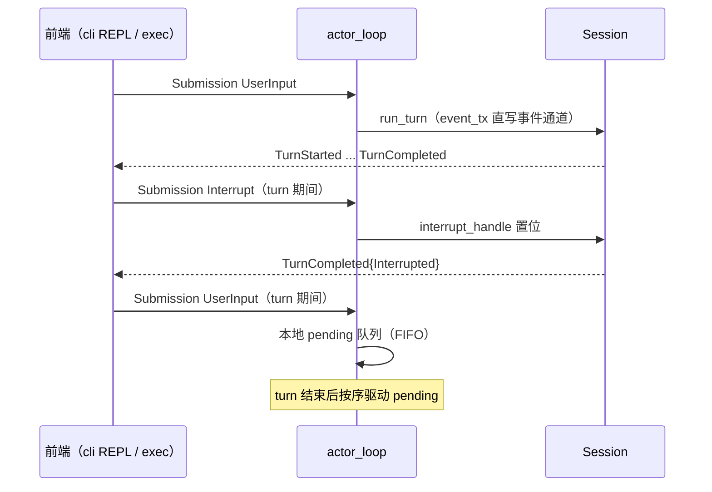

# 协议服务（wavecode-app-server）

## 职责

`wavecode-app-server` 以统一服务面暴露 core 能力（`crates/app-server/src/lib.rs`）。目标三种 transport（SPEC §4.2，语义一致）：**stdio**（NDJSON，Desktop/SDK 以子进程接入）、**WebSocket**（Web UI，支持多客户端订阅同一会话）、**进程内**（tokio mpsc 双工通道，零序列化，TUI 用）。**M1 仅落地进程内 transport（`InProcessClient`）**；JSON-RPC 编码层与 stdio/WS transport 随后续里程碑引入。另规划 `generate-ts`（从 `wavecode_protocol` 类型导出 TypeScript schema，SPEC §4.3）。

## InProcessClient

`InProcessClient::spawn(cfg: SessionConfig)`（须在 tokio runtime 上下文内，内部 `tokio::spawn`）：

- 两条 mpsc：submission 通道容量 **32**、event 通道容量 **256**；`Session::new` + `actor_loop` 任务。
- `submit(sub) -> anyhow::Result<()>`：投递请求，actor 已退出（通道关闭）返回 Err。
- `next_event() -> Option<Event>`：拉取下一事件；Shutdown 完成（actor 退出、通道关闭）后返回 None。
- **Drop 语义**：置中断标志（并发 poll 窗口内最佳努力）并 `abort()` actor 任务——模型流挂起（无安全点可达）时 actor 也不泄漏。

## actor_loop（串行驱动 turn）

- 串行驱动 turn；turn 期间经 `tokio::select!` 继续监听 submission 通道：`UserInput` **本地 FIFO 排队**（pending 无界——M1 进程内可信客户端可接受，不可信前端/stdio transport 需上限）、`Interrupt` 置位中断标志、`Shutdown` 置位 + 等待活动 turn 收尾（**2s drain 超时**）后退出。
- 无活动 turn 的 `Interrupt`：忽略（不发事件）；无活动 turn 的 `Shutdown`：直接退出。
- submission 通道关闭（客户端全部析构）即退出，等价隐式 Shutdown（置位 + 2s drain）。
- `Op` 标注 `#[non_exhaustive]`：未来新增 op 在 M1 忽略，`tracing::warn!` 留痕。
- `run_turn` 出错（core 已发 Error + TurnCompleted{Error}）：记 error 日志，**actor 继续存活**。
- 事件回填：`run_turn` 直接用 submission_id 作为 `Event.id`。

## 聚焦测试（`crates/app-server/src/lib.rs` tests）

`MockModel` / `GatedModel`（与 core 同构：脚本化 + 门控尾部；`repeat_tail` 控制 gate 置位后流结束或持续产出 sentinel——中断测试中每个流元素都是中断检查点，置位与处理之间无竞态）：

| 测试 | 锁定的行为 |
|---|---|
| `submit_user_input_streams_events_until_completed` | 一次 UserInput → 事件流（含 delta）→ TurnCompleted，id 回填 s-1 |
| `second_turn_after_first_works` | 中断标志每 turn 自清，连续两 turn 正常完成 |
| `shutdown_ends_event_stream` | Shutdown → 事件流关闭（next_event 收 None） |
| `submit_after_shutdown_returns_err` | actor 已退出后再 submit 返回 Err，不得静默丢弃 |
| `interrupt_during_turn_completes_interrupted_then_next_turn_ok` | turn 中 Interrupt → TurnCompleted{Interrupted}；actor 存活，下一 turn 正常 |
| `submissions_during_turn_are_queued_fifo` | turn 期间两个 UserInput 本地排队；s-1 的 TurnCompleted 先于 s-2 的 TurnStarted（FIFO 非 LIFO）；三元素保序 |

## 规划（M2+）

- JSON-RPC 2.0 编码层 + stdio（NDJSON）/ WebSocket transport；背压：每连接 bounded queue（默认 1024），写满返回 `-32001` 并丢弃最老通知（事件流允许丢帧重同步，请求不允许丢）。
- `actor_loop` 抽 transport 无关的内部构造函数（stdio/WS 复用）；Drop 路径补测试；MockModel/GatedModel 抽 dev-only 共享 fixture（SPEC §17.5 M2）。
- 事件 fan-out（broadcast 多客户端订阅，M5）；generate-ts 前端容错规范（容忍未知 type tag 与 stop_reason 字符串，M5）。

## 相关页面

- 协议契约：[前后端协议（wavecode-protocol）](../protocol/protocol.md)
- 引擎：[Agent 引擎（wavecode-core）](../engine/core.md)（run_turn / interrupt_handle 驱动模式）
- 消费者：[命令行入口（wavecode-cli）](../runtime/cli.md)、[前端与 SDK 占位包](../planned/frontends.md)
